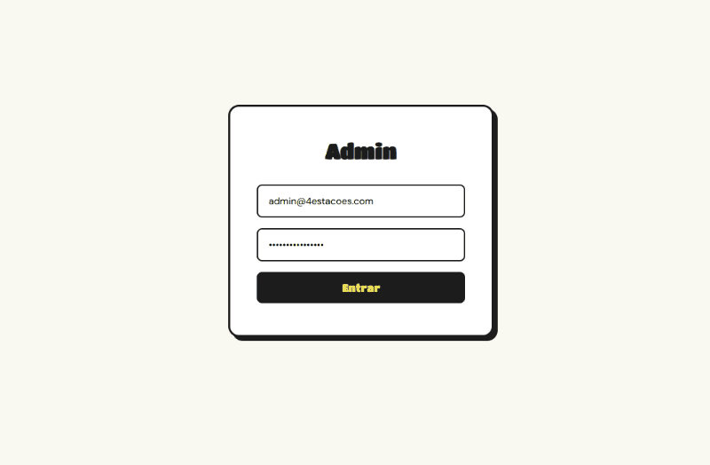

# 4 Estações

Online plant shop with an admin panel built as a portfolio project.

## Demo

### Home & Shop


### Admin


## Links
- [Live Demo](https://4estacoes-shop.vercel.app)
- Admin access — contact me at edd7carvalho@gmail.com

## Stack
- Next.js 15 (App Router)
- TypeScript
- Supabase (database + auth + storage)
- CSS Modules

## Features
- Plant catalogue with featured section
- Shopping cart with navbar dropdown
- Promotional pricing
- Protected admin panel with authentication
- Full CRUD for plants
- Image upload via Supabase Storage


## Local Setup

```bash
npm install
npm run dev
```

Create a `.env.local` file with your Supabase keys:

```
NEXT_PUBLIC_SUPABASE_URL=...
NEXT_PUBLIC_SUPABASE_ANON_KEY=...
```
